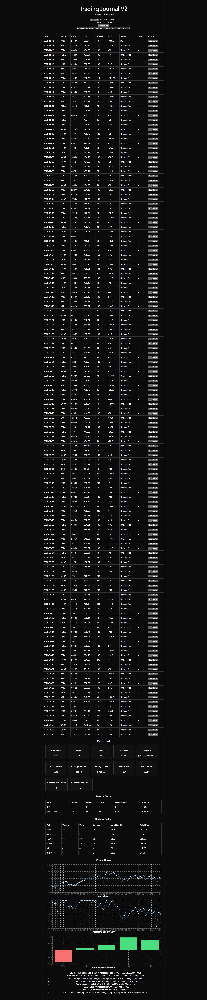

# 📊 Trading Journal V2

A web-based trading journal built with React that transforms raw broker data into structured trades, performance analytics, and actionable insights.

---

## 🖥️ Preview



---

## 🚀 Key Features

### 📥 Smart CSV Import (Real Broker Data)

* Supports broker order history CSV
* Filters only **“Filled” executions**
* Handles semicolon-separated files
* Cleans and normalizes raw data automatically

---

### 🔄 Order → Trade Conversion

* Groups multiple fills into a single trade
* Supports:

  * Scaling in
  * Scaling out
* Automatically calculates:

  * Entry time
  * Exit time
  * Average entry/exit price
  * Total PnL

---

### 🌍 Timezone Normalization

* Converts timestamps from local (NZ) to **New York market time**
* Enables accurate session-based analysis

---

### 💾 Local Data Persistence

* Trades are saved in **localStorage**
* Data remains after refresh
* No backend required

---

### ✏️ Trade Management

* Edit trade details:

  * Setup
  * Notes
* Delete individual trades
* Clean and flexible journaling workflow

---

### 🎯 Advanced Filtering System

Filter your trades by:

* Ticker
* Setup
* Win / Loss / Breakeven
* Date range

All filters dynamically update:

* Trade table
* Dashboard stats
* Charts
* Insights

---

### 📊 Analytics Dashboard

#### 📈 Key Statistics

* Total trades
* Win rate
* Average winner / loser
* Realized RRR
* Best & worst stock
* Winning & losing streaks

---

#### 📉 Charts

* Equity curve
* Drawdown
* Performance by day

---

### 🧠 Advanced Performance Analysis

#### 📌 Stats by Setup

* Identify your most profitable strategies
* Compare win rate and PnL per setup

#### 📌 Stats by Ticker

* See which stocks you trade best
* Identify weak tickers to avoid

---

### 💡 Smart Insights Engine

Automatically generates insights such as:

* Best and worst setups
* Strongest and weakest tickers
* Risk-to-reward behavior
* Losing streak warnings
* Performance feedback

---

## 🛠 Tech Stack

* **React (Vite)**
* **JavaScript**
* **Recharts** (data visualization)
* **PapaParse** (CSV parsing)
* **CSS** (custom styling)

---

## 📁 Project Structure

```
src/
  app/
  components/
    dashboard/
    trades/
  features/
  lib/
  styles/
```

---

## ▶️ How to Run

```bash
npm install
npm run dev
```

Open:

```
http://localhost:5173
```

---

## 📄 CSV Format

Supports broker order history CSV:

```
Date/Time;Symbol;Side;Quantity;Price;Event
```

Only rows with:

```
Event = Filled
```

are used.

---

## 🎯 Purpose

This project was built to:

* Analyze real trading performance using broker data
* Identify strengths and weaknesses
* Improve decision-making through data
* Build a structured trading review process

---

## 🧭 Roadmap

### ✅ Version 1

* CSV import
* Trade grouping
* Basic analytics

### ✅ Version 2

* Local storage persistence
* Trade editing & deletion
* Multi-filter system
* Stats by setup & ticker
* Improved insights engine

### 🔜 Version 3

* Time-of-day performance analysis
* Session-based analytics (Open / Midday / Close)

---

## 👨‍💻 Author

**Ralph Viado**
